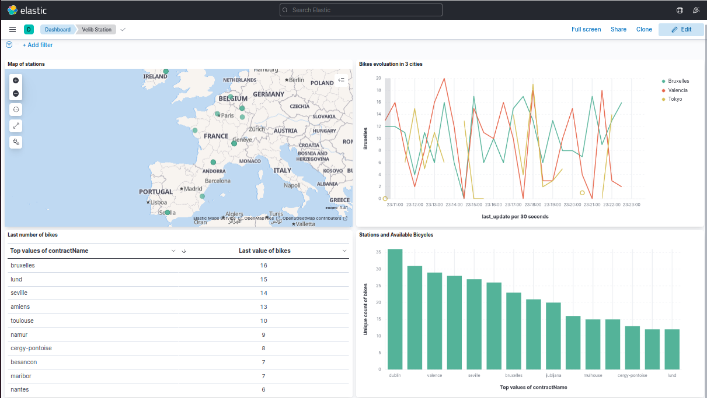
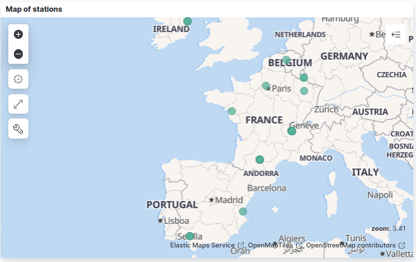
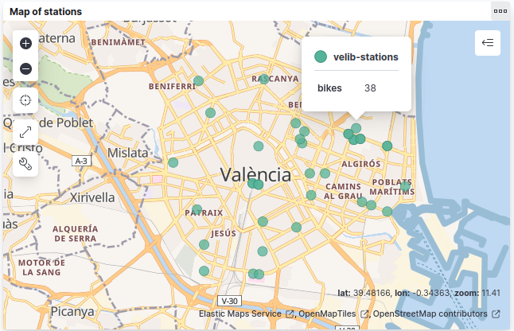
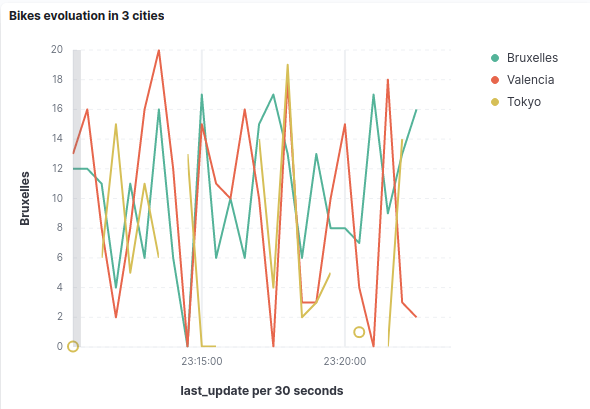
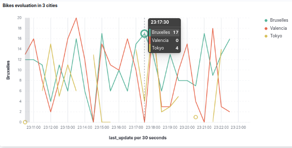
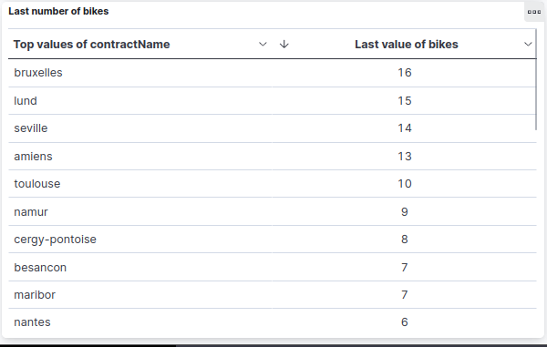

<h1 align="center">
  <br>
  Velib Cycling Stations Monitoring
</h1>

<div align="center">
  <h4>
    <a href="#overview">Overview</a> |
    <a href="#requirements">Requirements</a> |
    <a href="#setup">Setup</a> |
    <a href="#kibana-visualizations">Kibana Visualizations</a> |
    <a href="#installation-guide">installation guide</a>
  </h4>
</div>

<br>


# Overview

This Python script utilizes Apache Spark and Elasticsearch to monitor real-time status of Velib bike stations. It reads data from a Kafka topic, processes it with PySpark, and indexes relevant information into Elasticsearch. Kibana is then employed for data visualizations, taking advantage of the powerful analytics capabilities of the Elasticsearch-Kibana stack. Additionally, the script identifies and logs empty bike stations, providing valuable insights into station utilization and availability. The project integrates Hive LLAP (Live Long and Process), requiring dependencies on Hadoop, Hive, and Tez for optimized query performance.


# Requirements

Technologies Used:
| Technology  | Version  |
| ------------ | -------- |
|Spark         |3.3.1      |
| Elasticsearch | 7.17.16  |
| Kibana        | 7.17.16  |
| Kafka         | 2.13-3.6.0|
| Hadoop        | 3.3.6    |
| Hive          | 3.1.2    |
| Tez           | 0.9.2    |


For Python, ensure you have the following dependencies installed:

- `elasticsearch==8.10.1`
- `pyspark==3.5.0`
- `kafka-python==2.0.2`

You can install them using the following command:

```bash
pip install -r requirements.txt
```

# Setup

### Elasticsearch Setup:

1. Make sure Elasticsearch is running on `localhost:9200`.
2. The script creates an index named "velib-stations." If it already exists, it deletes and recreates it.

### Kafka Setup:

- The pyspark_code.py script reads data from a Kafka topic named "velib-stations" on `localhost:9092`.
- That Kafka topic was created in the file get_stations.py
- In the file get_stations.py change the API key with yours after creating an account at https://developer.jcdecaux.com/#/opendata/vls?page=getstarted

### Spark Configuration:

- The Spark session is configured to connect to Elasticsearch on `localhost:9200`.

### Running the Script

Before executing the main pyspark_consumer.py, ensure that Zookeeper and Kafka servers are running. You can start them using the following commands in different terminals and IN THAT ORDER:

1. Start Zookeeper:

   ```bash
   ./bin/zookeeper-server-start.sh ./config/zookeeper.properties
2. Start Kafka
    ```bash
   ./bin/kafka-server-start.sh ./config/server.properties
3. Run the get_stations.py file by doing
    ```bash
   python3 Stations_producer.py

after that you can run the main script with spark-submit
```bash
spark-submit --packages org.apache.spark:spark-sql-kafka-0-10_2.12:3.1.2 pyspark_consumer.py
```
# Kibana Visualizations 

### Kibana Dashboard



*Description:* This image displays the Kibana dashboard.

### Global Map



*Description:* This image provides an overview of the stations map in Europe.

### Valencia City Map



*Description:* This image presents the map for bike stations and their capacity in the city of Valencia.

### Bike Count Evolution in 3 Chosen Cities



*Description:* This image illustrates the evolution of bike counts in three selected cities: Brussels, Tokyo, and Valencia.



*Description:* When hovering over the plot, the number of bikes in each city appears in the window.

### Latest Bike Counts Table



*Description:* This image features the latest bike counts in different cities in the last 30 seconds.


# Installation Guide

### Reference PDF

For a comprehensive installation guide, you can refer to the [Installation Guide PDF](INSTALLATIONS_GUIDE.pdf) provided in this repository.

### Detailed Installation Steps

For specific and detailed installation instructions tailored to this project, please navigate to the [installation](installation/) folder in the repository.
